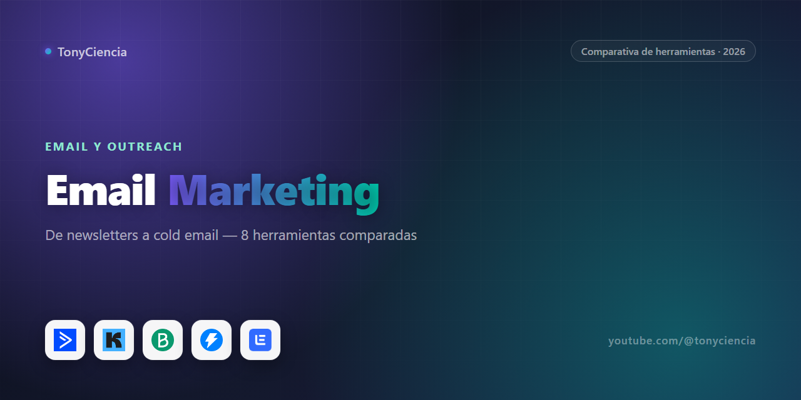

# Email marketing en 2026: la guía que uso yo, no un ranking de comisiones

Desde que Google y Yahoo endurecieron sus requisitos para remitentes masivos (SPF, DKIM, DMARC, límites de queja obligatorios), elegir mal tu ESP ya no es solo "perder plata en un plan caro" — es terminar directo en spam sin darte cuenta. Y sin embargo la mayoría de las comparativas de email marketing siguen mostrando las mismas cinco herramientas de siempre, ordenadas por cuál paga mejor comisión, como si newsletters, automatización y cold outreach fueran el mismo trabajo.

No lo son. Son *tres trabajos distintos* que casi nunca resuelve la misma herramienta — mezclarlos es la razón número uno por la que la gente termina frustrada con su ESP y jurando que "el email marketing ya no funciona". Acá los separamos.

## 🆕 Novedades

### Instantly suma un Copilot que arma automatizaciones describiéndolas en texto simple

Instantly Copilot (julio 2026) te deja escribir algo como "cuando un lead responda positivo, creá un contacto en HubSpot" y arma esa lógica por vos, desde la sección Engage → Automations. Se suma al AI Deliverability Agent, que monitorea la salud de tus dominios y bandejas para que tus emails no terminen en spam.

**[Probar Instantly →](https://refer.instantly.ai/ndtfrl3h0x5l)**

---

## Cómo armamos esta comparativa

Nada de esto sale de un ranking genérico. Las 8 herramientas de abajo son, hoy, el stack completo de partnerships de email marketing activos de TonyCiencia — excluimos a propósito cualquier programa que esté pendiente de aprobación, vencido o que directamente nos haya rechazado. Si una herramienta no aparece acá no es porque la olvidamos: es porque no probamos su programa de afiliados, o porque no pasó el filtro. Preferimos una lista corta y honesta a una larga y genérica.

## Comparativa rápida

| | Herramienta | Se usa principalmente para | Link |
|---|---|---|---|
|  | **ActiveCampaign** | Automatización avanzada + CRM liviano | [Probar →](https://try.activecampaign.com/x53ed2y6qns9) |
|  | **Kit** (ex ConvertKit) | Creadores y newsletters personales | [Probar →](https://partners.kit.com/v78kkgp588z9-uw04r) |
|  | **Brevo** | Volumen alto a precio bajo | [Probar →](https://get.brevo.com/p76y9av2p0t1) |
|  | **GetResponse** | Email + funnels + webinars en un plan | [Probar →](https://try.getresponsetoday.com/zxqczrj1idl8) |
|  | **AWeber** | Simplicidad para quien recién empieza | [Probar →](https://psjoin.aweber.com/z6tw712otfc8) |
|  | **Instantly** | Cold email a escala (B2B) | [Probar →](https://refer.instantly.ai/ndtfrl3h0x5l) |
|  | **lemlist** | Cold email con personalización | [Probar →](https://get.lemlist.com/ui9r4ec8cba9) |
|  | **Reply.io** | Outreach multicanal (email + LinkedIn + llamadas) | [Probar →](https://get.reply.io/gnjzwc6dspl8-p7peoq) |

---

Con la tabla ya a la vista, vale la pena entender *por qué* estas ocho y no otras — y sobre todo, cuál te toca a vos según lo que realmente estás mandando.

## Newsletter y comunicación con tu audiencia

Si lo que mandás es un boletín — contenido, no venta directa — la pelea real es entre **Kit** y **AWeber**, y se resuelve rápido según cuánto tiempo llevás escribiendo. Kit está pensado desde cero para creadores: segmentación por intereses, formularios de suscripción que no se ven genéricos, y un editor que no exige saber diseño. AWeber es más viejo en el mercado y eso se nota en algo bueno: es simple casi hasta el aburrimiento, lo cual para alguien que recién arranca es exactamente lo que necesita — menos botones, menos decisiones, más envíos hechos.

## Automatización de marketing (secuencias, scoring, triggers)

Ahora, si tu problema ya no es "qué escribo" sino "qué hago con miles de contactos en etapas distintas del embudo", el terreno cambia por completo. Acá **ActiveCampaign** gana por lejos: no es solo email, trae automatizaciones tipo "si el contacto hizo X, mandale Y y avisale al vendedor Z", con un CRM básico integrado. Es la herramienta correcta cuando tu negocio dejó de ser "mandar un boletín" y pasó a ser "nutrir leads hasta que estén listos para comprar". **GetResponse** compite en el mismo terreno pero suma funnels y webinars nativos, útil si tu proceso de ventas pasa por eventos en vivo en lugar de secuencias silenciosas.

## Volumen alto, presupuesto ajustado

Hay un tercer escenario que ninguna de las anteriores resuelve bien: cuando lo que importa no es la sofisticación de la automatización sino simplemente poder mandar mucho sin que el plan te reviente el presupuesto. Ahí **Brevo** (ex Sendinblue) sigue siendo la opción más barata por volumen de envíos — le sirve especialmente a ecommerce que dispara miles de campañas transaccionales al mes y necesita que el costo por email se mantenga bajo, no que la herramienta haga magia.

## Cold email / prospección B2B

Y después está la categoría que técnicamente ni debería estar en la misma conversación que las anteriores: el cold email. Acá no le hablás a gente que te dio su email — le escribís en frío a desconocidos que calzan con tu ICP, y eso cambia todo lo que la herramienta necesita resolver. **Instantly** está pensado para volumen: rotación de bandejas, warm-up automático, la infraestructura para no quemar tu dominio en la primera semana. **lemlist** apuesta más fuerte a la personalización — imágenes dinámicas, variables por prospecto, el tipo de detalle que hace que un cold email no se sienta cold. **Reply.io** suma llamadas y LinkedIn al mismo flujo, si tu outreach no vive únicamente en la bandeja de entrada.

## Preguntas frecuentes

**¿Puedo usar ActiveCampaign solo para newsletter, sin toda la automatización?**
Sí, pero vas a estar pagando por funciones que no usás. Si tu caso es 100% newsletter, Kit o AWeber son más baratos y más simples para lo mismo.

**¿Cuál es la diferencia real entre email marketing y cold email?**
Consentimiento. Email marketing le habla a gente que se suscribió. Cold email le escribe a desconocidos — necesita infraestructura distinta (rotación de dominios, warm-up) para no terminar en spam. Por eso Instantly/lemlist/Reply.io son herramientas separadas de ActiveCampaign/Kit/Brevo, no una opción dentro de las mismas.

**¿Brevo sirve para automatización o solo para envíos masivos?**
Tiene automatización básica, pero si tu necesidad principal es lógica compleja de nutrición de leads, ActiveCampaign te va a quedar mejor. Brevo gana en volumen/precio, no en profundidad de automatización.

---

### Sobre este repo

Comparativa mantenida por [TonyCiencia](https://youtube.com/@tonyciencia). Los links de arriba son de afiliado — entrar por ellos no te cuesta nada extra y ayuda a sostener el canal. Solo aparecen herramientas con relación de partner activa.

Última actualización: 2026-09-04.
